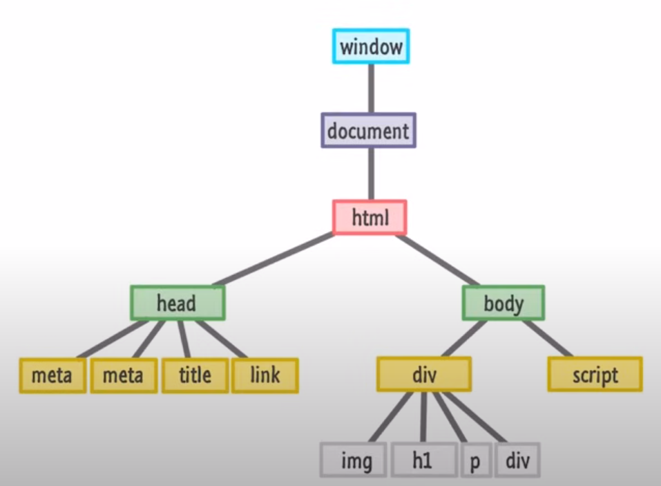

# What is DOM?
When a web page is loaded, the browser creates a `Document Object Model` (DOM) of the page

 

## DOM Manipulation

>[!Note]
>`Selecting with id` &nbsp;
>document.getElementBYID("myId") 
